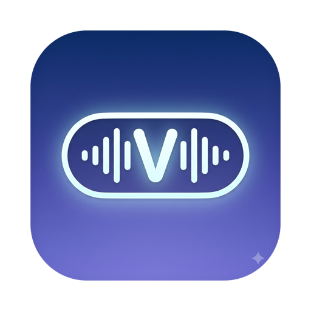

<p align="center">
  
</p>

<h1 align="center">Voxi</h1>

<p align="center">Local-first dictation for macOS, with a voice lane straight into Claude Code.</p>

Hold a key, say what you mean, let go. Your words appear at the cursor of whatever app you are in, punctuated and cleaned up, and no audio ever leaves your Mac.

That is the dictation half. The other half is Command Mode: hold a different chord and the same sentence becomes a task instead of text. Voxi drafts it into an action card, you pick a working directory, tweak the prompt if you like, and click **Dispatch**. The card runs in a headless Claude Code session with live logs streaming onto it. Say "add a dark mode toggle to the settings page" while you are looking at the code, and the work is queued before you have switched windows.

## What you get

- **On-device transcription** on Apple Silicon: Parakeet (default, via FluidAudio) or WhisperKit. Models download on first use and run locally.
- **A refiner that cannot strand you.** A rule-based cleanup pass works fully offline. You can layer a local LLM (Ollama, LM Studio, llama.cpp) or the Anthropic API with your own key on top; if the LLM errors, refinement falls back to rules and your words still land.
- **Three-tier insertion.** Accessibility API first, pasteboard if that fails, AppleScript as an opt-in last resort.
- **A command queue where you keep the trigger.** Voice creates cards; only the Dispatch button runs them. Follow-ups resume the same Claude session, and Run All drains the queue oldest first.
- **History with full-text search**, a personal dictionary for the words ASR keeps mangling, and a floating pill with a live waveform while you speak.
- **No accounts, no telemetry.** Idle footprint is about 120 MB.

## Build and run

Requires Xcode 26+, XcodeGen (`brew install xcodegen`), and macOS 14+ on Apple Silicon.

```sh
xcodegen generate
xcodebuild -project Voxi.xcodeproj -scheme Voxi -configuration Debug -derivedDataPath build build
open build/Build/Products/Debug/Voxi.app
```

The `.xcodeproj` is generated and gitignored. Edit `project.yml`, then rerun `xcodegen generate`.

## Everyday use

| Chord | What happens |
|---|---|
| **fn** (hold) | Push-to-talk. Speak, release, text lands at the cursor. **Esc** cancels. |
| **fn + Space** | Hands-free toggle for long dictation. |
| **fn + ⌃** (hold) | Command Mode: the dictation becomes an action card in the queue. |

All chords are configurable in Hub → Settings → Hotkeys. If fn triggers the system Globe action, set *System Settings → Keyboard → "Press 🌐 key to" → Do Nothing*; onboarding walks you through it.

The menu bar icon opens the **Hub**: history with full-text search, your dictionary, and settings for the mic, ASR engine and model downloads, refiner backends, and launch at login.

**Permissions.** Voxi needs Microphone (capture) and Accessibility (global hotkeys and text insertion). Onboarding requests both and re-checks them live.

A note for contributors: the project signs with a real Apple Development identity (team set in `project.yml`) because macOS keys TCC grants off the signing identity; ad-hoc signing would make you re-grant permissions on every rebuild. If grants go stale anyway: `tccutil reset Accessibility com.colin.voxi`.

## Poke it from the terminal

The whole pipeline runs headlessly, with no mic or permissions needed. This is also the automated integration surface.

```sh
BIN=build/Build/Products/Debug/Voxi.app/Contents/MacOS/Voxi
$BIN --transcribe Tests/Fixtures/audio/simple.wav      # raw ASR
$BIN --dictate    Tests/Fixtures/audio/correction.wav  # ASR + refinement
$BIN --command    Tests/Fixtures/audio/command.wav     # ASR + card draft JSON
# engines: --engine parakeet|whisperkit [--model <id>]
```

## Tests

415 tests via Swift Testing, run in-process against the app binary. Generate the spoken fixtures first:

```sh
./Scripts/make-test-audio.sh   # WAV fixtures via `say` (gitignored)
xcodebuild -project Voxi.xcodeproj -scheme Voxi -configuration Debug -derivedDataPath build test
```

One integration test spawns a real `claude -p` run and costs a few cents, so it sits behind an environment variable:

```sh
TEST_RUNNER_VOXI_CLAUDE_INTEGRATION=1 xcodebuild -project Voxi.xcodeproj -scheme Voxi \
  -configuration Debug -derivedDataPath build test -only-testing:VoxiTests/DispatchersIntegrationTests
```

## How it is put together

```
Hotkeys → Capture → Transcription → Refinement → Insertion       (dictation)
                                              ↘ CommandQueue → Dispatchers (claude-code)
Pill (status panel)   Hub (history / dictionary / settings)   Persistence (GRDB + FTS5)
```

One module per concern, joined by small protocols. A new speech engine, refiner backend, or card executor is one file plus one registry line; if a change needs more than that, the seam is wrong. `docs/architecture.md` has the module map and decision log, and contributor conventions live in `CLAUDE.md` and `steering/`.

## Licence

MIT. See [LICENSE](LICENSE).
