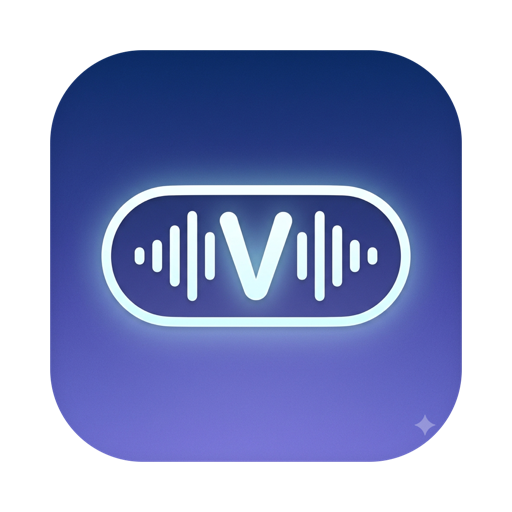

<p align="center">
  
</p>

<p align="center">
  
  
  
  
  
</p>

Hold a key, say what you mean, let go. Your words appear at the cursor of whatever app you are in, punctuated and cleaned up, and no audio ever leaves your Mac.

That is the dictation half. The other half is Command Mode: hold a different chord and the same sentence becomes a task instead of text. Voxi drafts it into an action card on the Hub's queue; you pick a working directory, tweak the prompt if you like, and choose how it runs — hand it to an interactive Claude Code session in iTerm (the default) or run it headless with live logs streaming onto the card. Say "add a dark mode toggle to the settings page" while you are looking at the code, and the card is waiting before you have switched windows — a notification tells you it landed, and nothing steals your focus.

Nothing runs without that click. Voice creates cards; only a dispatch button executes them.

## What you get

- **On-device transcription** on Apple Silicon: Parakeet (default, via FluidAudio) or WhisperKit. Models download on first use and run locally.
- **A refiner that cannot strand you.** A rule-based cleanup pass works fully offline. You can layer an LLM on top — a built-in on-device model (downloaded once, runs in-process), your own Ollama / LM Studio / llama.cpp endpoint, or the Anthropic API with your own key; if the LLM errors, refinement falls back to rules and your words still land.
- **Three-tier insertion.** Accessibility API first, pasteboard if that fails, AppleScript as an opt-in last resort.
- **A command queue where you keep the trigger.** A master–detail pane in the Hub: cards list on the left, full prompt/params/logs on the right. Follow-ups resume the same Claude session, Run All drains the queue oldest first, and Clear Finished tidies up after.
- **History with full-text search**, a personal dictionary for the words ASR keeps mangling, and a floating pill with a live waveform and the name of the mic that is actually listening.
- **No accounts, no telemetry.** Idle footprint is about 120 MB.

## The look

The palette is racing green and cream, worn like a vintage enamel badge. The floating pill commits to the dark "Night Race" capsule on every desktop, so you always know it at a glance; the windows follow your system appearance with a light "Paddock" theme and a dark one built from the same tokens. Queue cards wear racing-number discs in dispatch order, and the design rules live in [`steering/DESIGN_SYSTEM.md`](steering/DESIGN_SYSTEM.md).

<p align="center">
  
</p>

## Everyday use

| Chord | What happens |
|---|---|
| **fn** (hold) | Push-to-talk. Speak, release, text lands at the cursor. **Esc** cancels. |
| **fn + Space** | Hands-free toggle for long dictation. |
| **fn + ⌃** (hold) | Command Mode: the dictation becomes an action card in the queue. |

All chords are configurable in Hub → Settings → Hotkeys. If fn triggers the system Globe action, set *System Settings → Keyboard → "Press 🌐 key to" → Do Nothing*; onboarding walks you through it.

The menu bar roundel opens the **Hub**: history with full-text search, the command queue (⌘J jumps straight to it), your dictionary, and settings for the mic, ASR engine and model downloads, refiner backends, and launch at login.

**Permissions.** Voxi needs Microphone (capture) and Accessibility (global hotkeys and text insertion). Onboarding requests both and re-checks them live.

## Build and run

Requires Xcode 26+, XcodeGen (`brew install xcodegen`), and macOS 14+ on Apple Silicon.

```sh
xcodegen generate
xcodebuild -project Voxi.xcodeproj -scheme Voxi -configuration Debug -derivedDataPath build build
open build/Build/Products/Debug/Voxi.app
```

The `.xcodeproj` is generated and gitignored. Edit `project.yml`, then rerun `xcodegen generate`.

A note for contributors: the project signs with a real Apple Development identity (team set in `project.yml`) because macOS keys TCC grants off the signing identity; ad-hoc signing would make you re-grant permissions on every rebuild. If grants go stale anyway: `tccutil reset Accessibility com.colin.voxi`.

## Poke it from the terminal

The whole pipeline runs headlessly, with no mic or permissions needed. This is also the automated integration surface.

```sh
BIN=build/Build/Products/Debug/Voxi.app/Contents/MacOS/Voxi
$BIN --transcribe Tests/Fixtures/audio/dictation.wav    # raw ASR
$BIN --dictate    Tests/Fixtures/audio/correction.wav   # ASR + refinement
$BIN --command    Tests/Fixtures/audio/command.wav      # ASR + card draft JSON
# engines: --engine parakeet|whisperkit [--model <id>]
```

## Tests

551 tests via Swift Testing, run in-process against the app binary. Generate the spoken fixtures first:

```sh
./Scripts/make-test-audio.sh   # WAV fixtures via `say` (gitignored)
xcodebuild -project Voxi.xcodeproj -scheme Voxi -configuration Debug -derivedDataPath build test
```

One integration test spawns a real `claude -p` run and costs a few cents, so it sits behind an environment variable:

```sh
TEST_RUNNER_VOXI_CLAUDE_INTEGRATION=1 xcodebuild -project Voxi.xcodeproj -scheme Voxi \
  -configuration Debug -derivedDataPath build test -only-testing:VoxiTests/DispatchersIntegrationTests
```

## How it is put together

```
Hotkeys → Capture → Transcription → Refinement → Insertion       (dictation)
                                              ↘ CommandQueue → Dispatchers (claude-code)
Pill (status panel)   Hub (history / queue / dictionary / settings)   Persistence (GRDB + FTS5)
```

One module per concern, joined by small protocols. A new speech engine, refiner backend, or card executor is one file plus one registry line; if a change needs more than that, the seam is wrong. `docs/architecture.md` has the module map and decision log, and contributor conventions live in `CLAUDE.md` and `steering/`.

## Licence

MIT. See [LICENSE](LICENSE).
